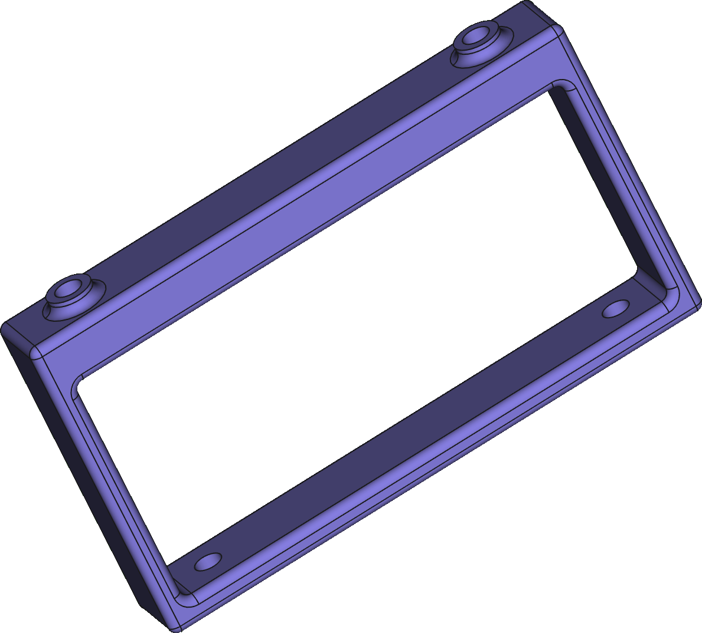
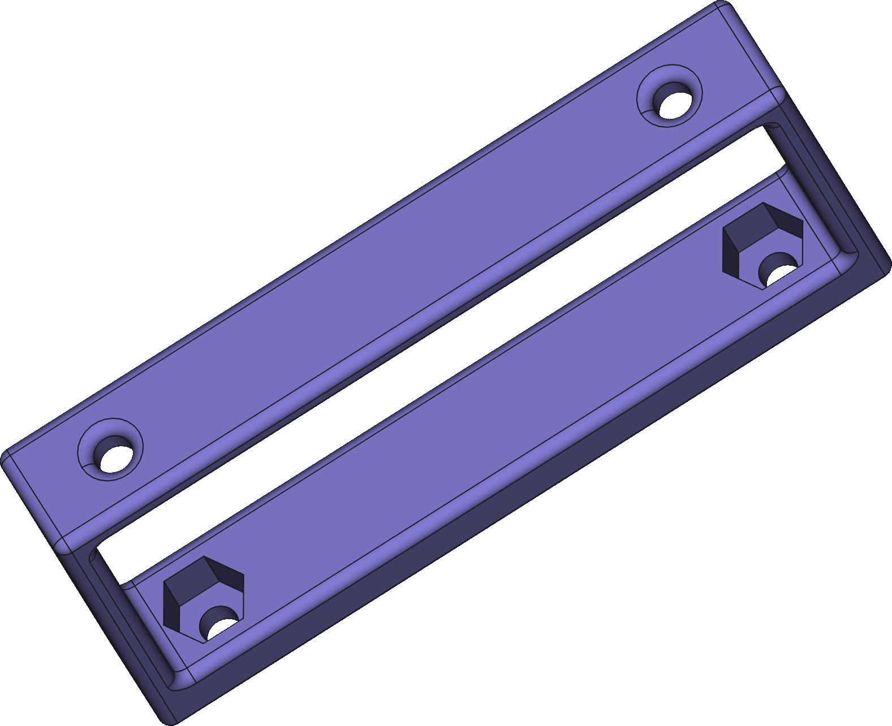
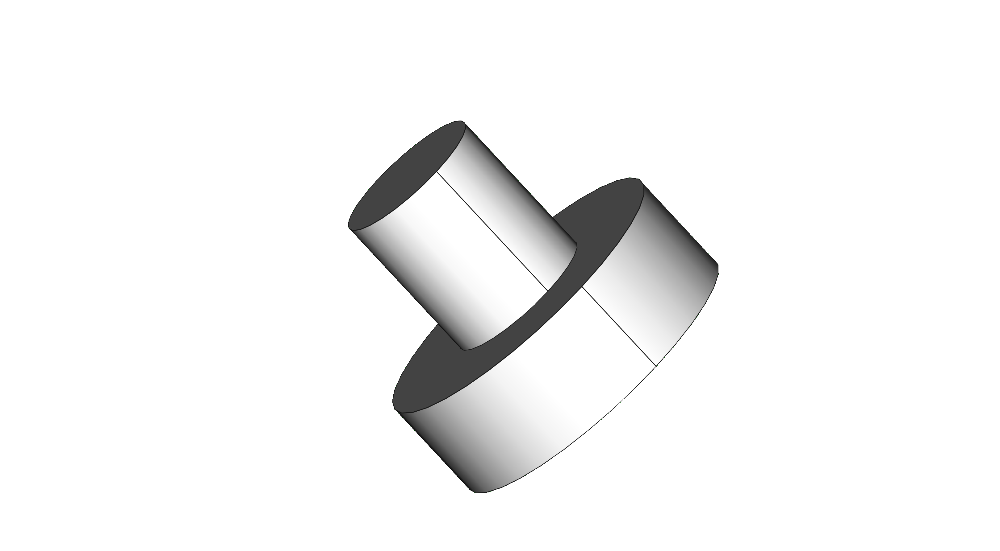

# Preface

> Skip to [Build]() if you aren't interested in ~~my life story~~ 2020.

Building this little Pi cluster has been a journey, one that is not yet over. I plan to catalogue the process here, and share all of the code, 3d-designs, learnings and anything else that comes from it, for all to share.

The plan for the cluster is/was to run Kubernetes, something I began learning in my professional work a little while before this project began. Because the cluster is to be headless, I decided that a rack case would be ideal and I could mount the Raspberry Pis and stuff them into my server rack at home. I looked around for something suitable and came across this plastic case;



The obvious choice was to mount some heat sinks and stick some fans in the case. I bought some 40mm fans to put in the back of the case like network switches and similar devices have, only to find that the inner height is less than 40mm 🤦. No problem, I'll make holes in the top, create a fan controller, fit it all together and run some thermal testing. All of this led to a [post on the Raspberry Pi forums to discuss my findings](https://www.raspberrypi.org/forums/viewtopic.php?f=29&t=271862#p1648048).

Needless to say (If you read the post over the Raspberry Pi Forum), I wasn't too happy with the result, and left it be for a while. With the year which never happened almost over, I decided to try again. In the mean time, I had taken up 3D printing and began learning CAD / 3D Design using [FreeCAD](https://freecadweb.org/index.php). 

I had a new idea; 3D print something compact which could be placed in the rack, but with much better cooling. First I looked around for rack mount cases that were already available, there were a few, and they all had something in common; they looked great, and they were all over engineered or used far too much plastic. The other major issue is that they required fans mounted directly to the Pi, or passive cooling. What I really wanted was something upon which I could mount a "large" 80mm+ fan.

Less is more, as they say, so I took to designing something which would provide the bare minimum needed to hold the Pis together, cool them and contain the power-block as part of the design.

# Build

Fortunately, the design of the Raspberry Pi lends very well to using standoffs to hold the little SBCs (Single Board Computers) themselves together nicely, so all I needed was a base and a fan mount. With this idea in mind, I took to designing; here is the complete part list (minus cables/wires);

## Hardware

* Cluster
    * 3D Printed parts (STLs below)
    * (1x) 4+ Port USB Power Supply (See mount diagram below for dimensions)
    * (3x) Raspberry Pi 4B
    * (12x) M3x15 (+6mm of screw thread) standoffs
    * (4x) M3x6 Bolt
    * (4x) M3 Nut
* Fan Mount
    * (1x) 92mmx10mm PC fan (5V ideally or 12V if running at lower speed)
    * (2x) M3x25 Bolt (Long; for mounting to fan mount);
    * (2x) M3x20 Bolt (Short; for mounting fan shroud)
    * (2x) M3 Washer
    * (4x) M3 Nut

> _NOTE ON FAN DIMENSIONS_: If the 12V fan you have doesn't work at 5V, use a 5V fan (Noctua makes the NF-A9 which comes with a USB adapter cable; I haven't used it personally so YMMV) or a step-up voltage converter. *Bear in mind, all of the 5V fans I've seen are thicker, so you'll need longer bolts than those listen above*. If you're measuring a fan yourself, that the advertised sizes are end-to-end dimensions of the outer frame for box-type fans, the distance between holes in the 92mm fan is closer to ~82-83mm.

## The Foundation

The power block I was using due mainly to already having it to hand from the first attempt, is fairly weighty, it was immediately obvious that it would make the perfect base to stack the Pis upon. I wanted to come up with a simple, minimal way of mounting the Pis atop this power block, the result;

> [Download the STL for 3D printing](files/power-mount.stl)

Here's a projection drawing of the dimensions to measure against a power block you may have.

[](images/power-mount-drawing.svg)

The underside of the mount has cut outs for M3 nuts, and on the very bottom, 3mm holes for feet;

The feet are a quick, simple design I threw together to print in TPU; Printing TPU, it turns out, is hard!

For a bowden-style 3D printer, it's important to disable retraction, lower the speed drastically to ~10mm/s and I found that printing multiple units, spaced apart gives each layer just enough time to cool before it moves onto the next layer that it'll print pretty nicely.

> [Download the STL for 3D printing](files/foot.stl)

With two of the power brick mounts, and 4x the foot printed, you can begin to mount the Raspberry Pis. Note that the Raspberry Pi appears to use M2.5 mounting holes, so it'll need a little encouragement to fit the M3 standoffs, but I managed it without too much effort.



Drop the nuts into the slots on the bottom and screw the standoffs through the first Raspberry Pi and into the nut in the base. I was using nylon standoffs but it may be easier to thread the holes in the base with metal ones, or widen them a little by tapping (with an M3 tap) or a 3mm drill bit.

> Note: I found that the Anker power brick I'm using isn't a perfect cuboid, it tapers inwards in two dimensions towards the USB ports; I believe the shape is called a "frustum" of a (4 sided) pyramid. I had some hook and loop (the soft, loop side) pads stuck to my power brick from the previous mounting in the rack case, and this helped hold it in place nicely in the bracket on the thinner side. In the future I may design something more flexible on the size of the power brick used.

Once complete, mount the second and third Raspberry Pis using the standoffs;



## Fan Mount

For the fan, I wanted something minimal but stiff, so I designed a light-weight frame in FreeCAD with a bit of strengthening. I'm a complete beginner at 3D modelling so it's a best effort on my part with some of my general Engineering knowledge thrown in, it works pretty well and the dimensions for the screw holes and 92mm fan holes are perfect. There are vertical slots for a little leeway with the standoff hight, although the ones I used mount the Pis at about the exact distance apart you want; any closer and the metal port shrouds may touch solder joints on the bottom of the next.



> [Download the STL for 3D printing](files/fan-mount.stl)

Start by fitting the fan mount to the top of the Pi stack using the M3 screws, you'll end up with this;



## Fan

The fan I'm using is a 12V PC fan, however, it runs just fine at 5V, at a reduced speed, with the added benefits that it's quiet and uses very little power (a fraction of a Watt, vs the 2.5W rating the fan is capable of) and it still moves a decent amount of air.

I simply soldered a USB connector to a male fan connector so I can plug it in/out. Inside the USB end, I soldered the D+ and D- together using a short wire so they're not floating (this is recommended for power-only connectors).



The last part of building; mounting the fan. For this I needed a shroud, there was no need to design my own, there a plenty of capable people sharing their excellent work, so I used this great honeycomb shroud by [_mightynozzle_](https://mightynozzle.com/3d-models/customizable-fan-grill-cover) which I found on Thingiverse.

I chose the honeycomb version of course, because, well, I like hexagons (See the site's logo? =)



First mount the cover to the fan using the two shorter bolts. Then using the longer ones, mount the fan and cover to the fan mount, use the washers on the back-side of the mount where the nut goes leaving you with your cluster!



In the next part I'll cover the thermals, the tools I used to track them and share the configuration so the setup can be replicated.