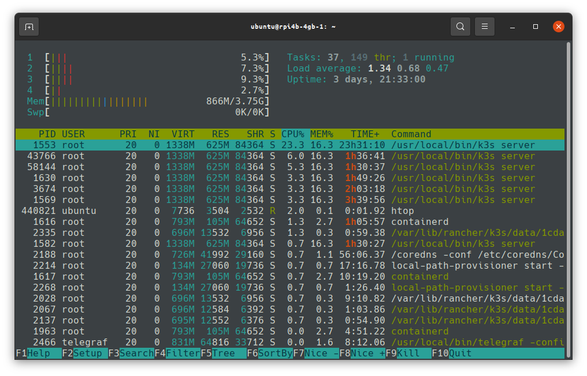
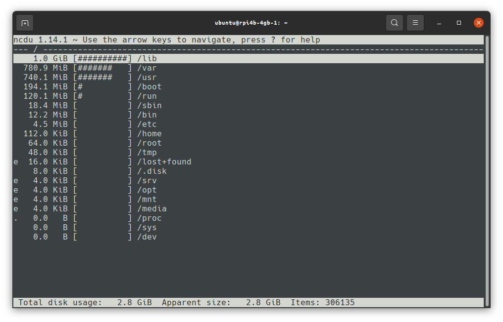
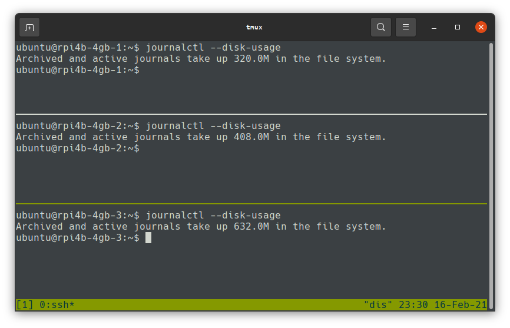
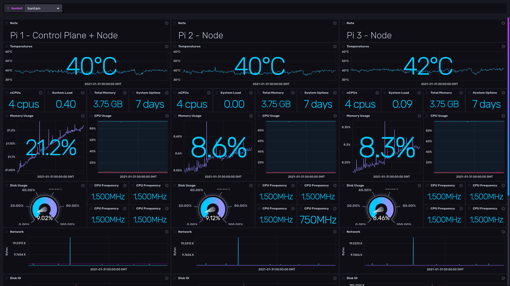

Part two of this series will cover configuring your Pis. Before we get started there are some prerequisites;

# Prerequisites

## SD Preparation
You will need one SD card for each Pi, if you're following this blog exactly, flash them with the [Ubuntu Server 20.04.1 64bit for Raspberry Pi (Direct link to Ubuntu download site)](https://ubuntu.com/download/raspberry-pi/thank-you?version=20.04.1&architecture=server-arm64+raspi)

## Pi Power
Hopefully, if you followed the previous post [bantamCloud - Part 1 - Building](https://2byt.es/post/bantamcloud/01-build/) you already have a power brick as part of your cluster. You'll need 3 short USB-C cables to connect the Pis to the power brick, 15-30cm should be fine but they won't be great for the aesthetic (I'm still working on a way to get some short, perfect length cables with right-angle connectors for a nice clean build).

## Fan Power
Hopefully you bought a fan with a USB adapter such as the 5V Noctua ones suggested in my previous post. If not, you can make one like mine with a little soldering skill and a spare fan connector and USB plug; feel free to repurpose some old USB cable and fan connector if possible!

## Networking
Although it is possible to use WiFi, I would recommend using ethernet for a cluster like this and this blog with explicitly use ethernet. You'll need a small network switch or 3 spare ports on your router.

## Pi Preparation
1. I will be using Ununtu 20.04 aarch64 on my Raspberry Pis. You can use Raspbian and things should mostly be the same since they're both Debian based distros, but there may be some differences, particularly related to configuration of the Pi.
2. Start by adding a user for yourself and enabling SSH Keys by following my previous post: [SSH 2-Factor’s First Factor](https://2byt.es/post/totp2)
3. (Optional) Set up 2-Factor authentication for SSH using: [SSH 2-Factor on Linux (RPi)](https://2byt.es/post/totp)
4. Update all packages to latest on all of the Raspberry Pis.
5. (Optional) Purge snapd - It's wasting resources and I always uninstall it on any Ubuntu machine;
```
snap list
(list of installed snaps is printed)
sudo snap remove --purge <package name from list above>
(once all snaps are removed)
sudo apt remove --purge snapd
```
* Remove `cloud-init`, we don't need it.
```
sudo apt remove --purge cloud-init
```

# Configure
## Static IPs

It's good practice for servers to have static IPs on your network. Hopefully you've connected the Pis to your network by now, and they've all been assigned IPs. If possible, find a range of 3 addresses by looking at your router to see which IPs are already taken, and assign those in sequence, for a nice easy to remember IP range.

Don't worry if your Pis already have addresses you don't want to use; so long as you find a range of addresses which aren't used by other devices in your network, we'll statically assign them on each Pi.

### Netplan
Ubuntu 20.04 uses Netplan to configure networking, if you're using `Raspbian` this configuration won't apply, and you'lll need to look up how to configure networking in `/etc/network/interfaces`.

Find the Netplan file, in my case it was created by cloud-init and it's found at `/etc/netplan/50-cloud-init.yaml, mine looks like this;
```
network:
    version: 2
    ethernets:
        eth0:
            dhcp4: false
            addresses: [192.168.31.41/24]
            gateway4: 192.168.31.1
            nameservers:
                    addresses: [192.168.31.1]
```

In my case, my Pis are on a subnet of `192.168.31.41/24` and my "gateway" or router is `192.168.31.1` and I'm only using IPv4 networking. My gateway is also a name server, as with many routers. Using your router IP for your DNS can be useful if you want to be able to talk to other devices on your network from the Pi, it will forward any addresses it can't find locally to your ISPs DNS or whichever is configured in the router e.g. 1.1.1.1 (Cloudflare) or similar.

## Disable Bluetooth and Wi-Fi, and reduce GPU memory
Since we're not going to use Bluetooth or Wi-Fi, it's a good idea to disable them, it'll save some resources and may even help the Pi run a little cooler.

Because we're on Ubuntu, `raspi-config` is not available, so we will need to edit the config files.

### GPU Mem

Reducing the GPU memory means that more RAM is available for the system to use, this is recommended when running as a server since we won't be displaying anything or using the GPU.

First, edit `/boot/firmware/config.txt` and add `gpu_mem=16` under the `[all]` section:

> NOTE: This file recommends not editing it but instead editing `usercfg.txt`, however, I've been unable to make this value take effect by setting it anywhere other than here.

It should now look something like this;

```
[all]
gpu_mem=16
arm_64bit=1
device_tree_address=0x03000000
```

Reboot your Pi, and if you installed `vcgencmd` by following my post on it, you can check the split;
```
vcgencmd get_mem gpu
gpu=16M
```

> NOTE: There are also settings for CMA allocation of memory "dynamically" for the GPU, but I haven't investigated these yet.

### Wi-Fi and Bluetooth

We can use the handy `dt-overlay` feature to disable these and save a few resources;

Edit `/boot/firmware/usercfg.txt` and add the following lines:

```
dtoverlay=disable-bt
dtoverlay=disable-wifi
```

Reboot to apply the changes, then run `iw list`, if nothing at all is output, you've successfully disabled Wi-Fi. To test if bluetooth is disabled you can use `bluetoothctl list` if it's installed. If it is, uninstall it once you've checked Bluetooth is disabled, `sudo apt remove bluetooth`.

### Disable LEDs (Optional) 

This one is a little extreme, but I didn't want any light emitted since my Pis were originally in a case where I could see the LEDs, so disabling them seemed like a nice idea, here is the configuration if you want to do the same.

This will disable both the activity and the power LEDs after boot, the Pi will appear as if it is off;

In the `/boot/firmware/usercfg.txt` add 5 new lines;
```
dtoverlay=act-led
dtparam=act_led_trigger=none
dtparam=act_led_activelow=off
dtparam=pwr_led_trigger=none
dtparam=pwr_led_activelow=off
```

Reboot to apply the changes

## Other Tools / Setup (Optional)

### HTOP

`htop` is a very nice way to monitor the resources on your system, I tend to install it as one of the very first things on any new system, server or otherwise.



> This Pi is busy running as a Kubernetes (using K3s) Control Plane (Kubernetes "Server" Node)

### ncdu - NCurses Disk Usage

`ncdu` is another tool handy tool I really enjoy using, it helps visualise where space is being used up most on a system, and to clean it up with simple key presses. Be sure to run it as root (sudo) if you want to read directories outside of home;

`sudo ncdu /`:



### Log to RAM

If you're using micro SD cards for your Pi OS like I am, it is a good idea to move your logs to RAM. By moving your logs to RAM, you reduce write wear on the micro SD cards and reduce the time to failure.

Follow the instructions at [azlux/Github](https://github.com/azlux/log2ram) to install and configure log2Ram, which is a set of scripts which will manage the hard work for you.

I've customised a couple of settings to my preference in `/etc/log2ram.conf`;
* SIZE=30M
* USE_RSYNC=true
    * Be sure to install rsync with `sudo apt install rsync`
* MAIL=false

I've also disabled the daily write to disk, as I'm generally not interested in persisting logs (It'll still write on shutdown/reboot);
```console
sudo systemctl disable log2ram-daily.timer 
```
You should now start the log2ram service, but it may not yet start if your `/var/log` directory is too large. Go through the steps below to clean up and limit the journal log size then come back to start log2ram;
```console
sudo systemctl start log2ram
```
> NOTE: If you set the size to 30M like I have, you may not be able to start log2ram yet. Once the journal logs are cleaned up below, you'll have more luck.

## Limit systemd journal logs



Systemd logs provide a plethora of information on services and their status for systems which use it, but by default it can store and retain huge numbers of logs, we should clean up what's there and limit the maximum size, and there will be less for log2ram to handle.

Clean up existing logs. First rotate the existing logs to archive them; the following commands will only clean up archived logs, not active ones:
```console
sudo journalctl --rotate
```
Next, "vacuum" the logs to clear anything older than a certain period. I like 7 days, but set this as required. This performs an immediate cleanup but doesn't yet set a limit:
```console
sudo journalctl --vacuum-time=7d
```
Next, clean up by size too, I tend to keep this low too because I'm not too interested in logs from when I'm not around, I'm usually looking at them when I'm actively breaking things, again change this to a value you're happy with:
```console
sudo journalctl --vacuum-size=10M
```
Next, edit the journal config `/etc/systemd/journald.conf`
and set the `SystemMaxUse` to less than the log2ram value, be sure to uncomment it by removing the `#` at the start.
```console
SystemMaxUse=20M
```
Finally, restart journald for the change to take effect:
```console
sudo systemctl restart systemd-journald
```

For further information on journalctl and how to use it, check out the Ubuntu [man(ual) page](https://manpages.ubuntu.com/manpages/focal/man1/journalctl.1.html) 

### Troubleshooting log2ram startup
If log2ram fails to start, here's some tips for troubleshooting;
* You can check why using `sudo journalctl -u log2ram`; if the issue is `ERROR: RAM disk for "/var/hdd.log/" too small. Can't sync.`, you either need to clean more logs or increase the log2ram size.
* Using `ncdu` you can check your current log size; `sudo ncdu /var`, look for the size of the `log` directory. If it's too large, you can:
    * Rotate and clean up more logs by specifying a smaller number, e.g. `10K`
    * Clean up some files manually, bearing in mind that some services might fail to log if the file is missing (a quick reboot should hopefully solve this)
    * Increase the log2ram size to a value you're happy with and is bigger than the current size of `/var/log`.

## Telegraf/InfluxDB



If like myself, you'd like to keep an eye on what your Pis are upto, InfluxDB is a great way to show all of your stats in a Dashboard. InfluxDB 2.x includes the dashboard built in, previously you would have to run Chronograf or Grafana, but that's no longer necessary.

First of all, setup InfluxDB 2.x. You should run it on a machine which is always on, because it needs to collect your metrics. You could also run it on one of the Pis in your cluster but I prefer not to do this as it uses up resources we want for other tasks.

For a quick setup, you can run Influx in Docker, once you have a suitable machine to run it on, with Docker installed, start InfluxDB;

> NOTE: This is an insecure setup for testing only, it does not mount a volume to keep your data if the container is stopped, it also does not provide HTTPS.

```console
docker run -d -p 8086:8086 --name influxdb quay.io/influxdb/influxdb:v2.0.4 --reporting-disabled
```

> The `--reporting-disabled` flag tells influxdb to disable the phone-home reporting it does by default, and is "opt-out". You can choose whether or not to supply this flag, but I, personally am strongly opposed to opt-out phone-home features and aim to disable them as a matter of course wherever possible.

Once you have started InfluxDB, you can browse to it using `http://<ip of machine with influx>:8086`.

### Board Variables
I have configured the Dashboard to use three variables so that you only need to change the hostnames of your Pis in one place. Create 3 variables in the Settings menu called `pi1`, `pi2` and `pi3`. The variables should be `query` type with the following query;
```
from (bucket: v.bucket)
  |> range(start: v.timeRangeStart)
  |> keep(columns: ["host"])
  |> distinct(column: "host")
  |> filter(fn: (r) => r["host"] == "<pi hostname>")
  |> keep(columns: ["_value"])

```
For each variable set the `<pi hostname>` to the value of each of your Pis as they'll be reported by Telegraf.

> Note: You could modify the dashboard to only show one Pi per screen, by removing two thirds of the cells and edit a single variable removing the host specific filter in order to allow any number of Pis to be displayed by switching between them with the variable. This would be more scalable for larger clusters.

### Install Telegraf

Telegraf is a "collector" component. It is a small binary, which runs on the machine you want to collect data about, it also comes from Influx, and when configured through its configuration file, collects data and sends it to InfluxDB for storage and graphing.

Start by downloading the ARM binary for Telegraf to each of your Pis, visit the Influx download page ([here](https://portal.influxdata.com/downloads/)) for the current version, be sure to select "Linux Binaries (ARM)")!

> Influx has Documentation [here](https://docs.influxdata.com/telegraf/v1.15/introduction/installation/) on installing using their apt repository for Ubuntu, I haven't tested these as I installed the binary and systemd unit file it comes with manually, but this method should be easier and allow your Telegraf to update with apt rather than manually like mine;

Here's my `telegraf.conf` to deploy to each Pi, be sure to set your token, organisation, bucket and Influx IP/hostname: [telegraf.conf](files/telegraf.conf)

# Done

That's it for `bantamCloud - Part 2 - Configure`. I hope some of the tools and techniques here have been useful. In Part 3 I'm going to cover setting the cluster up for Kubernetes with `K3s` and cover some of the many caveats to running Kubernetes on a cluster of Raspberry Pis.