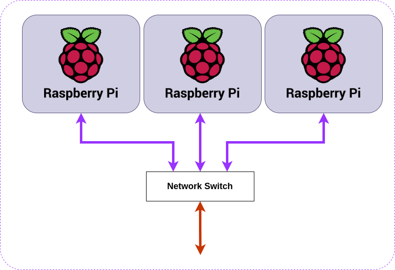
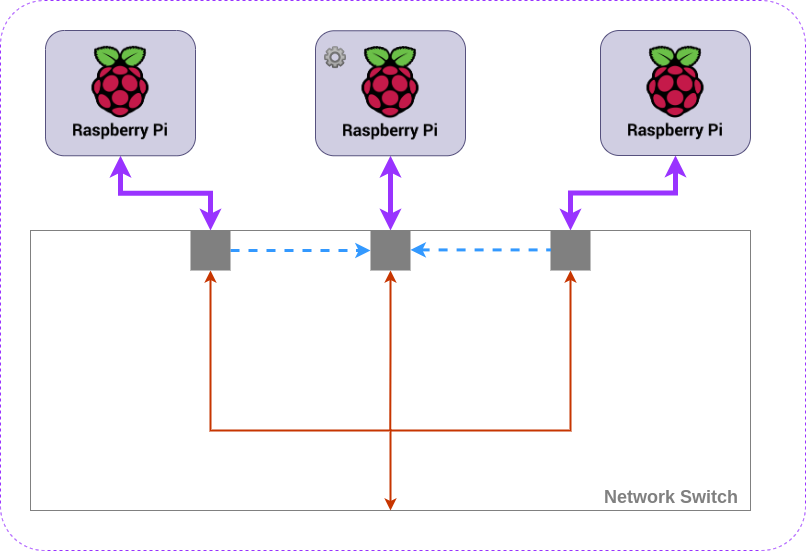

Part 2.5 of the bantamCloud series is going to cover some of the caveats of running Kubernetes on a cluster of Raspberry Pis. Many of these challenges will also apply to running on other _bare metal_ (computers you own) systems as opposed to running in the cloud (e.g. AWS, GCE, DOKS etc). Many of these challenges can be overcome, others will need to be accepted as compromises, but either way, these are worth knowing before we begin our installation and configuration of Kubernetes.

<!--more-->

In my experience, the challenges of deploying Kubernetes to Raspberry Pi, or other bare-metal systems fit roughly into two (2) or three (3) categories;

1. (Raspberry Pi) Architecture
2. Storage
3. Networking

The last two of these challenges almost universally apply when you're deploying and running Kubernetes yourself, on your own hardware. The first (Architecture) depends on where you're deploying (e.g. Raspberry Pi vs Desktop/Server), I'll explain more as we hit that section. Networking is the most complex (and a lengthy read) so I'll leave that until the end.

Let's begin with Architecture;

# Architecture

I could write for hours about CPU architectures, I graduated from an Engineering department whose alumni notably include Sir Robin Saxby, the first CEO of (ARM)[https://en.wikipedia.org/wiki/Arm_Ltd]. We wrote ARM assembly, studied microprocessor design where we implemented a (MIPS)[https://en.wikipedia.org/wiki/MIPS_architecture] instruction set in (VHDL)[https://en.wikipedia.org/wiki/VHDL], and even laid out simple parts of an ARM SoC silicon using a pencil and paper. I built my dissertation project on FPGAs, which can run ARM cores implemented in software!

Needless to say, it's a topic I find extremely interesting. Alas, this post is already of out hand (I wrote the networking section first), so I'll try and get to the point.

Raspberry Pis processor architecture is "arm". ARM as an architecture is everywhere, it powers billions of devices all over the planet. Use a smartphone? Almost certainly ARM. That shiny new Apple chip in all the new Macs? Yep, ARM. Raspberry Pi? ARM, of course!

The point here is the comparison between ARM as an architecture, and the currently prevalent desktop/server architecture known as "x86". I say currently prevalent because with Apple's latest move and the growing popularity for data centres to start offering ARM compute, this may well change in the future.

So what is the difference and why does it matter? Instruction sets are like languages. When you compile code written in a human-friendly language like Assembly, C, C++, Golang etc it must be translated into "computer language". This process takes the code you've written, and when told the target architecture, will translate the code into something the processor understands.

Like human language has vocabulary, so too does a computer processor, this vocabulary is the "instruction set", except in computer vocabulary these "instructions" are things like "add", "subtract", "multiply" as well as other more complex "instructions".

The difference between ARM and x86, to put is _extremely_ simply, is that they speak _different languages_. They don't understand each others instructions.

*Phew* finally, the point is in sight!

When you run an image/container in Kubernetes or Docker, it is quite likely something which has been compiled. Now, when it comes to Docker Hub, and other such repositories for images, it's entirely possible that the images available are compiled for x86 and will _not_ run on Raspberry Pi. This is important to bear in mind if you do not intend to write and compile your own code to run in your cluster.

**Check all of the software you intend to run has an ARM version.**

This is of course before we even get onto the topic of 32bit vs 64 bit ARM architectures, but that's another topic for another day. Rule of thumb is a 64bit SoC can run a 64 bit or 32bit OS and 64 bit or 32 bit code. A 32 bit SoC can run only 32 bit code (and not 64 bit). Just by having a Raspberry Pi 4 (64 bit SoC) doesn't mean you can run 64 bit programs, you also need to be running 64 bit Linux, which until recently Raspberry Pi OS did not provide support for.

> The lack of a 64 bit Raspberry Pi OS was the main deciding factor in my using Ubuntu 64bit when I started this project in early 2020.

# Storage

In order to run any software, you need somewhere to store it. Kubernetes deploys containers and they need to be stored. It also needs to log and perform other functions. K3s, the implementation of Kubernetes we're using on the Pi uses SQLite as its storage backend. SQLite is a file based database software. It's much more lightweight than etcd which "full fat" Kubernetes runs. Etcd is a beast and needs high speed SSDs to play nice, so would be _much_ worse on the Pi.

## Endurance

The Raspberry Pi runs on Micro SD cards by default. Micro SD cards do not provide the level or read/write endurance a proper storage drive like a desktop SSD or spinning drive does. The Raspberry Pi also has very little in the way of protection circuitry/logic for the MicroSD slot, and things like poor power supply, power cuts etc can corrupt SD cards. I've killed a dozen or more high-quality Micro SD cards in Raspberry Pis over the years. Because of this, Micro SD storage is not ideal for write-heavy workloads, such as Kubernetes, *Caveat Emptor* (buyer beware).

One solution to this issue is to mount a more durable storage device, use a high quality flash USB stick, or even plug in a USB HDD or SSD (although USB storages comes with its own caveats). I've even seen eMMC based devices which fit into the slot on the Pi and emulate a Micro SD. These provide a much more durable storage device as eMMC durability and speed is better than that of Micro SD. I've not yet had the pleasure of testing these myself.

## Mobility

The next issue of storage in a bare metal Kubernetes cluster is that of mobility. By mobility I mean, the availability of your data across your nodes. If your software stores data on the Pi using volumes, and one of your containers falls over, it may be scheduled on a different Pi, in this case, the data isn't available, because it was on the first Pi which may not be available now.

Solving this issue is much more complex, and there are entire products and even organisations dedicated to solving it. The short version of the answer to this problem is to use networked storage (such as NFS or "S3 compatible" block storage). The problem here is that the solution almost certainly requires additional hardware, like a NAS to storage your data off of the Pis, this adds additional burden to the network interface and may adversely affect performance.

# Networking

The astute amongst the readers of the first parts of this parts of this series may be wondering; why is there no network switch included as part of this build?

This was not an omission. But the reason for it, is only one of the networking challenges of running Kubernetes on Raspberry Pi.

## Topology

 Figure 1

Figure 1 shows a typical setup for a triplet of Raspberry Pi on a simple network. 

Let's assume for a minute we're using Raspberry Pi 4B devices, these have 1Gb (1 Gigabit) network connections, one each, for a total of 1GB of network "throughput" per Pi.

If we were to attach a network switch like this to our Pis giving the cluster a single connection to the outside world, via our network switch, we are limited by the uplink speed (orange arrow). On a typical home router or switch, this is very likely also 1Gb.

This limitation means that the maximum speed in and out of the entire cluster is 1Gb/s (1 Gigabit per second), to take a very simplistic view of the situation, we'd be wasting 2/3 of our total bandwidth, more on this later.

### Kubernetes "Chatter"

Kubernetes by its nature requires that your nodes can call the API server, this sits on the control-plane(s). This "chatter" is used to monitor state, as well as to reconcile the state which is desired vs the state that _is_. This messaging, back and forth between nodes is constant and the amount of chatter grows the larger your cluster and the more it is running.

For this chatter to occur, there needs to be a connection between the nodes and the control plane, and in Figure 1 we see there is a connection, so what's the problem?

 Figure 2

Figure 2 shows the communications occuring in a Kubernetes cluster in terms of the network switching. The control plane node is represented by the ⚙️, it is placed in the middle to simplify the diagram. Each node must communicate with the control-plane, this is indicated by the blue dashed line. This constant communication uses up some of that 1Gb bandwidth of the network interface on the Pi, leaving the rest, the orange line, for communication with the outside world.

Now, if we have only 1Gb out of the bottom of our switch, known as "upstream", and Kubernetes is using less than 2/3 of the bandwidth of each node to chat to the control plane, the upstream 1Gb port on our switch is a bottleneck.

### "Better" Networking

Given the limitations we've just discussed, there are a few options for better network throughput. Some of these are not practical, or possible without additional hardware.

In order to understand how the networking could be better, it is important to decouple it from the Pis themselves and think more generally, so that's what I'll do here where appropriate.

#### Fatter Pipe (Works with Pi)

Within the construct of the Pis, the easiest solution to gain maximum "upstream" potential is to use a switch with a "fatter" pipe. In other words, a network stream with a port capable of more than 1Gb to connect it to rest of the network would allow us to maximise the 1Gb capability of each Pi.

There are network switches with 10Gb or more "upstream" links for example, they're not cheap, and you need other network hardware capable of handling this higher bandwidth, then would need to be accessing the cluster from a machine with more than a 1 Gb connection, or from multiple machines each with 1Gb to share the cluster badwidth.

As you can imagine this is an (expensive) rabbit hole.

#### Additional Network Connections (_Maybe_ works with Pi)

An alternative option is to separate the Kubernetes networking, from the networking required to access your applications on the cluster. Such a separation might be called a "backend" and a frontend", where the "backend provides a network for Kubernetes traffic" and the "frontend" provides the user traffic.

This approach is best, and with another system which isn't a Pi, it may have additional network connections already, or more can be added.

This is where the "maybe" comes in;

##### Pi has WiFi

If you're feeling adventurous, you could configure the WiFi as one network for one set of traffic, and ethernet for the other. If you're running a typical network with a single home router, this gets complicated and you'd need VLANs, alternative subnets or a separate switch altogether.

Good luck.

##### Pi has USB - USB network adapters exist

This is no less adventurous than the previous option, but possibly more reliable; you'd still potentially need a second switch, or a larger switch with VLANs, but a USB adapter in each Pi would give you more bandwidth.

I don't want to go into too much detail on either of these options, I don't consider them practical but they're useful in understanding the options and limitations of networking in scenarios such as this.

### "Do Nothing" Networking

Lastly, there is the option to do nothing special, and connect the Pi cluster straight to the nearest switch you have and get on with your day. This is a perfectly reasonable option, and given the other limitations at play here, is the one I would advise until one is familiar enough with the basics to think more about this.

## Load Balancing

In order to take advantage of a Kubernetes cluster which can move pods around dynamically between nodes as required, it becomes necessary to load balance your application frontend. When a workload (this is what an "application" or "software" is known as when run on Kubernetes), is deployed, it may run multiple replicas, for example, a web service with a REST API might run 3 replicas, and these replicas may be split one per Pi or per host. When you access this service, you want to access a single endpoint, and not have to guess which of your three (or more) hosts/Pis the web service is running on. This is handled by a load balancer.

Kubernetes is heavily geared towards cloud providers and their load balancers. It is able to hook into the APIs of the big players in the cloud, and deploy load balancers automatically, updating endpoints and ensuring failover happens all without you leaving your Kubernetes manifests. When you're deploying your own cluster on bare metal, options are limited, but there are solutions.

### Metal LB (In cluster)

The first option, and possibly the best for an automatic deployment is [MetalLB](https://metallb.universe.tf/). MetalLB runs in your cluster like any other workload. Metal LB offers two modes, "layer 2" where it uses ARP to manage load balancing. This is easy to set up, but it is important to understand the deficiencies of this option. The details are out of scope for this post, so I recommend reading up on the Metal LB site for more details.

The second mode of MetalLB is "BGP". This is powerful, and is the protocol which the backbone of the internet runs on. The downside of this option is that it requires supported routers. Your typical ISP provided router likely does NOT support this option.

### Software Load Balancer (External)

A software load balancer can sit in front of your cluster, it works as a software switch to choose between which of the nodes behind it traffic should be routed to. A software load balancer detects which node to use by performing a health check, it will ping an endpoint on each node per your specifications, whichever one responds will receive traffic, this could be one, some or all. How traffic is routed to the nodes is often configurable in a variety of ways including round-robin, least connections, weighted, and more. It is also possible to use to enforce "sticky sessions", in this mode, users/clients will be routed to the same node, where possible.

One such software load balancer is (HA Proxy)[https://www.haproxy.org/]. HAProxy is a powerful yet easy to configure TCP/HTTP load balancer. Some cloud providers have based their own load balancers on HAProxy.

Software load balancers such as HA proxy have one inconvenience though; they need another piece of hardware in front of your cluster to run on. This can be a virtual machine, or another Pi for example but may be totally out of the question if you don't have something to run it on. The other downside of using a load balancer like this, is that they are typically not integrated with Kubernetes. You'll have to configure it manually for each Ingress/Service you wish to deploy to your cluster.

# Conclusion

There are a few caveats to running Kubernetes on Raspberry Pi, some of these exist for any bare metal deployment, even if you were to use more powerful machines, but there are solutions to all of those challenges.

Ultimately, the only real downside, supposing the solutions provided here are acceptable, is likely to be performance.

The issues of automating load balancing, storage which can move with your pods, and endurance of your Micro SD can be overcome, so long as the software you need to run is available for ARM or you are writing your own code which compiles for ARM. With Apple's move towards ARM on the desktop/laptop, and data centres providing more and more ARM servers, the issue of architecture may begin to fade.

My personal opinion is that Pi is a great platform to learn Kubernetes and the challenges it poses when deploying on bare metal, and provides the opportunity to understand the solutions to load balancing, storage management all while allowing you to simulate failover scenarios like pulling the network cable, or turning off a node, things which can't easily be simulated in Minikube or similar.

Since I already have much more powerful servers on which I run Kubernetes at home, and in the cloud, I'll likely dedicate this cluster to "serverless functions" using (OpenFaaS)[https://www.openfaas.com/] and deploying code I write in my language of choice, Golang, compiled for ARM 64 bit (aarch64).