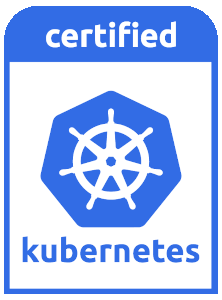
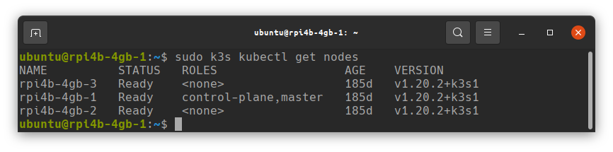
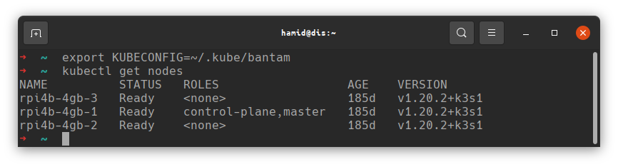
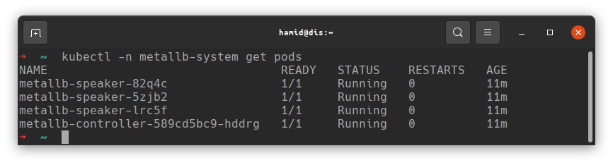
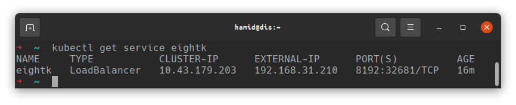
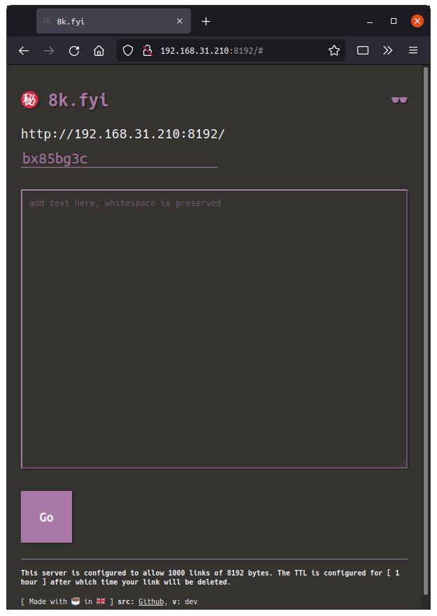
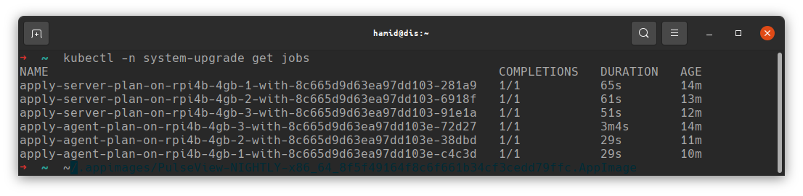
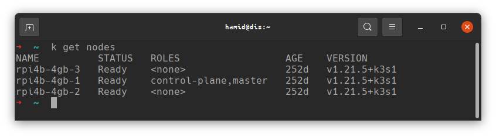

# Preface

There are numerous ways to run Kubernetes, with a plethora of certified distributions, hosted options, installers and more, all [certified by the Cloud Native Computing Foundation (CNCF)](https://www.cncf.io/certification/software-conformance/). The CNCF is the place to look for all things in the Kubernetes ecosystem, but if you're here, you hopefully already have a good idea of what Kubernetes is all about.

What we need, is a solution for deploying Kubernetes in a lean, simple to deploy way, bearing in mind we want to run on Raspberry Pi which uses the ARM architecture.

Certified Kubernetes distributions will carry a badge, something like this;



Certification means that the distribution has been through a test process to ensure compatibility and passed, and it is certified to be compatible with the Kubernetes API and ecosystem. We want to use one of these certified distributions if we want to learn Kubernetes, and there are a few to choose from.

Choosing a distribution is really down to preference, so long as the distribution supports your desired architecture (ARM in this case), the rest is about the ease of deployment, documentation and tooling.

For my deployments I use [K3s by Rancher Labs](https://github.com/k3s-io/k3s), see their README about why the name "K3s". One of the benefits of K3s is that it is deployed as a single Golang binary, and it supports multiple architectures. I can't honestly say how I came across it, or why I chose it, but at the time, it was the only light-wight, simple to deploy distribution I was aware of that would run on the Raspberry Pi, and I have a strong preference towards tools written in Golang is at has been my primary language, both personally and professionally for 6 or 7 years now.

There are other similar options such as [K0s](https://github.com/k0sproject/k0s), also written in Go and supporting both ARM and x86-64 architectures, I have no experience with this distribution, but with 4.1k stars on Github, vs K3s's 18k stars (as of October 2021), it's fairly popular.

The beauty of Kubernetes Certified distributions is that once you understand and build for one, you can mostly shift your workload to another and run it there, the main caveat being that many cloud distributions offer "add-on" functionality such as cloud load balancers, storage options etc, which are provider dependent, and usually more integrated than bare-metal options, they also often require somewhat bespoke configuration depending on provider.

I have run code on K3s, Digital Ocean's DOKS, Amazon EKS (AWS), Minikube and "full-fat" Kubernetes deployed using Kubespray. On the whole, the bulk of the work is similar, with some key differences, which I have covered in the previous post, Part 2.5 of this series, titled "Caveats". These differences are usually fairly minor, and can be handled with annotations, or a change in a few variables for a Helm Chart; The point is, learn Kubernetes with one, and you'll be in good standing to run on Kubernetes elsewhere.

So, without further ado, let's get to installing. With K3s, installation using the default configuration is trivial, but it may not provide all of the features you want or need.

See the [K3s website](https://k3s.io/) if you want to learn more about it.

# Configurations

By default, K3s will use [Traefik](https://github.com/traefik/traefik) as its Ingress Controller, and will use an internal service-load-balancer. This will not however provide load-balancing between your nodes from outside of the cluster, for this an external load balancer is required, or something like [MetalLB](https://metallb.universe.tf/).

For Ingress Controllers, Traefik is fun and nice to use, but for serious workloads I prefer [Ingress NGINX](https://kubernetes.github.io/ingress-nginx/), not to be confused with [NGINX Ingress Controller](https://docs.nginx.com/nginx-ingress-controller/).

If you intend to use MetalLB (we'll do that below) and/or an alternative Ingress Controller besides Traefik, export as required the following "no-deploy" arguments, to tell K3s not to deploy them for us. Be sure to run this in any terminal you open **on the Raspberry Pi control-plane node**, not your local machine, before starting the install.

> I would recommend at least exporting the `--no-deploy servicelb` argument since we'll be using MetalLB here.

```
export INSTALL_K3S_EXEC=" --no-deploy servicelb --no-deploy traefik"
```

See the [K3s documentation](https://rancher.com/docs/k3s/latest/en/) for more details on how it can be configured for installation.

# Install

First, pick a control-plane node, previously known as a "master" node; it doesn't matter which you use, unless you have a Pi with more RAM than the others, consider using that as a "Schedulable" control-plane (meaning it can run Pods as well as being the controller).

This control-plane node is the node which will coordinate the cluster. In production deployments, this should be several nodes, for high availability, but for our little cluster, a single control-plane node will suffice.

SSH into your first node, the one you've chosen to be the control-plane and run the following command after exporting your `INSTALL_K3S_EXEC` values as required.

> NOTE: Given my security and privacy concious nature, I'm obligated to recommend you read the contents of the shell script this command is going to run on your machine before running it. Better yet, download the script, read it, then execute it locally.

```
curl -sfL https://get.k3s.io | sh -
```

Once this has completed, you'll need to obtain the server token, this is used by your worker nodes to join the cluster. Obtain it by issuing the following command;

```
sudo cat /var/lib/rancher/k3s/server/token
```

While you're on this node, make sure to grab its IP address if you don't already know it:
```
ip --brief --color addr
```
Find the ethernet adapter and grab its IP.

Next, go to each of your remaining nodes in turn and run the following command, substituting the server token obtained in the previous step and the IP from the control-plane node;

> NODE: There is no need to tell the agent nodes about `--no-deploy` flags, the control-plane manages that.

```
export K3S_TOKEN="<server token>"
export K3S_URL="https://<ip of control-plane node above>:6443"
curl -sfL https://get.k3s.io | sh -
```

This will deploy K3s on each of the nodes where you run it, and join them to the cluster. If everything goes successfully, you should be able to run `k3s kubectl get nodes` from your *control-plane* Pi node, and see a list of the nodes in your cluster.



To access the cluster from your workstation you'll need to obtain the kubectl config file, and, of course [install kubectl](https://kubernetes.io/docs/tasks/tools/);

Copy the file at `/etc/rancher/k3s/k3s.yaml` on the control-plane node to your local machine, and edit the line `server: https://127.0.0.1:6443` changing the IP to point at the control-plane Pi's IP address rather than localhost.

If you're running Linux and you've already installed `kubectl`, copy the file you just obtained to `~/.kube/config`, that's to say, the file should be named simply `config` and it should be placed in a directory named `.kube` in your home directory.

Alternatively, call the file whatever you wish, place it wherever you wish and export the environment variable `KUBECONFIG` with the path to the file.

Now, if all has gone well, you should be able to run `kubectl get nodes` from your workstation and see your Kubernetes cluster nodes;

> NOTE: I have multiple clusters' configurations so I export `KUBECONFIG` with the path to the config for each file, which I keep in `~/.kube` for tidiness.



You now have a working Kubernetes cluster.

If you want to actually connect to services you deploy there, now is a good time to get MetalLB installed if you haven't already, and, if you chose to exclude Traefik, look at installing an alternative Ingress Controller such as Ingress NGINX.

> Don't forget, Raspberry Pi runs on ARM, you'll need images built for ARM to run on there, such as my [8k.fyi](https://github.com/2bytes/8k) project.

## MetalLB

Install MetalLB using the Helm chart;

> Helm: https://helm.sh/docs/intro/quickstart/

> NOTE: Ensure you have a subnet available on your router which can be allocated to the cluster, and that ARP is working correctly, as MetalLB will use Layer 2 / ARP to notify of IP address changes. The address range also needs to be correctly routable by your router. I suggest reading the Helm website for further details.

If you have issues deploying MetalLB into your cluster, it is always possible to deploy a load-balancer externally to the cluster, see the previous section of this series for examples of external load-balancer options.

First lets make sure we have the Helm Chart repo for MetalLb:
```
helm repo add metallb https://metallb.github.io/metallb
```

Next, create a file named `values.yaml`; For reference, the contents of my `values.yaml` are as follows;

```
configInline:
  address-pools:
  - name: default
    protocol: layer2
    addresses:
    - 192.168.31.210-192.168.31.220

```
Be sure to use an ip address range which is suitable for your network, then install MetalLb:

```
helm -n metallb-system --create-namespace install metallb metallb/metallb -f values.yaml
```
This will create a new namespace `metallb-system` and install MetalLB there. If all went well, you should see the controller and speakers running;



You should now be able to deploy a workload and MetalLB will assign an IP.

Let's deploy `8k` (https://github.com/2bytes/8k), which is a little project of mine, to test the cluster;

Create `service.yaml`:
```
apiVersion: v1
kind: Service
metadata:
  name: eightk
spec:
  selector:
    app: eightk
  ports:
  - port: 8192
    targetPort: http
  type: LoadBalancer
```
Apply `service.yaml` to the cluster:
```
kubectl apply -f service.yaml`
```
Now create `deployment.yaml`:
```
apiVersion: apps/v1
kind: Deployment
metadata:
  name: eightk
  labels:
    app: eightk
spec:
  selector:
    matchLabels:
      app: eightk
  replicas: 1
  template:
    metadata:
      labels:
        app: eightk
    spec:
      containers:
      - name: eightk
        image: ghcr.io/2bytes/8k:v1.0.7
        ports:
        - name: http
          containerPort: 8192
        resources:
          limits:
            cpu: 300m
            memory: 128Mi
          requests:
            cpu: 200m
            memory: 64Mi
```
Apply `deployment.yaml` to the cluster:
```
kubectl apply -f deployment.yaml
```
The pod should start, and MetalLB should have assigned an IP to the service, check as follows;



You can now take the `EXTERNAL_IP` and `PORT` values and connect from your web browser. In this case I would enter http://192.168.31.210:8192



> HTTPS/TLS NOTE: In Kubernetes, Service(s) do not manage TLS, that is the job of the Ingress. In order to use HTTPS you will need an Ingress Controller such as Traefik or Ingress-NGINX and a way to obtain certificates. Alternatively, 8k supports providing certificates directly and you can configure it to terminate its own TLS, see the instructions at https://github.com/2bytes/8k for details.

# Upgrading Kubernetes (k3s)

> NOTE: Refer to Rancher documentation for the latest versions: https://rancher.com/docs/k3s/latest/en/upgrades/automated/

Kubernetes is a rapidly changing environment, and it is important to keep up to date with the latest revisions as features are added and removed. Fortunately, with K3s, upgrading can be performed using an in-cluster upgrader;

## System Upgrade Controller

> NOTE: v0.8.0 is current at time of writing, be sure to use the current version when you implement this: https://github.com/rancher/system-upgrade-controller/releases/latest

```
kubectl apply -f https://github.com/rancher/system-upgrade-controller/releases/download/v0.8.0/system-upgrade-controller.yaml
```

Once the system upgrade controller is deployed, some upgrade "Plan(s)" are required, one for "server" and one for "agents";

## Server Upgrade Plan

> IMPORTANT: If you initially deployed with a later version of K3s than I did, the "master" label may not exist on the server node, change the `key` in this and the agent yamls to use the `control-plane` nomenclature: `node-role.kubernetes.io/control-plane`. You can check which labels it has by running `kubectl describe node <name of server node>` and checking the labels listed.
```
apiVersion: upgrade.cattle.io/v1
kind: Plan
metadata:
  name: server-plan
  namespace: system-upgrade
spec:
  concurrency: 1
  cordon: true
  nodeSelector:
    matchExpressios:
    - key: node-role.kubernetes.io/master
      operator: In
      values:
      - "true"
  serviceAccountName: system-upgrade
  upgrade:
    image: rancher/k3s-upgrade
  channel: https://update.k3s.io/v1-release/channels/stable

```

This plan will install the latest current stable release, from the stable release channel. The channel can be changed if you want something else. See the [Rancher Docs for Release Channels](https://rancher.com/docs/k3s/latest/en/upgrades/basic/#release-channels) to choose the appropriate channel.

## Agent Upgrade Plan

The agent upgrade plan waits for the server upgrade job to complete so the order it is deployed isn't important, just deploy both plans and wait.

Like the Server Upgrade Plan above, the Agent Upgrade Plan also sets a channel, be sure this matches what was set in the Server Upgrade Plan. I recommend sticking with stable channel unless you need the latest features.

```
apiVersion: upgrade.cattle.io/v1
kind: Plan
metadata:
  name: agent-plan
  namespace: system-upgrade
spec:
  concurrency: 1
  cordon: true
  nodeSelector:
    matchExpressios:
    - key: node-role.kubernetes.io/master
      operator: DoesNotExist
  prepare:
    args:
    - prepare
    - server-plan
    image: rancher/k3s-upgrade
  serviceAccountName: system-upgrade
  upgrade:
    image: rancher/k3s-upgrade
  channel: https://update.k3s.io/v1-release/channels/stable
```

Finally, if your `kubectl` is quite out of date, be sure to download the latest version of `kubectl` on your workstation for compatibility.

Kubernetes supports a version skew of 3, meaning your client (kubectl) and server (k3s) should be no more than 3 versions apart in order to avoid issues.

Once the jobs have been applied, and your kubectl is current, check the status.

> NOTE: it will take a few minutes, but eventually both Plans should run on each node.



Once it is completed, you should be able to see that your nodes are now all up to date:



> NOTE: When I started this series I was running v1.20.x, if you're following the initial install now, you may already have a newer version than that shown in the upgrade above.